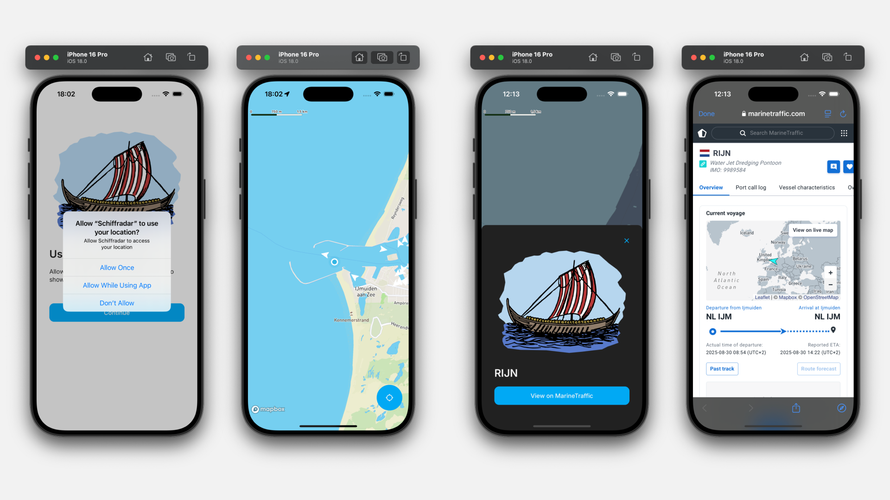

# Schiffradar

[](https://github.com/artyorsh/schiffradar/actions?query=branch%3Amain)

## Description

Schiffradar (German for "Ship Radar") - a mobile application that tracks vessels in real-time using AIS data.
Works in combination with [aisstream.io ingestion server](https://github.com/artyorsh/schiffradar-api).



## Stack

- [](https://github.com/expo/expo/blob/main/packages/expo/CHANGELOG.md)
- [](https://github.com/facebook/react-native/releases)
- [](https://github.com/react-navigation/react-navigation/releases)
- [](https://github.com/vitalets/react-native-unistyles/releases)
- [](https://github.com/mobxjs/mobx/releases)
- [](https://github.com/inversify/InversifyJS/releases)
- [](https://github.com/jestjs/jest/releases)
- [](https://github.com/callstack/react-native-testing-library/releases)
- [](https://github.com/rnmapbox/maps/releases)
- [](https://github.com/microsoft/TypeScript/releases)
- [](https://github.com/eslint/eslint/releases)

## Features

- AIS data polling with advanced configuration options (see [architecture components](#key-architecture-components)).
- Interactive map with markers and data clustering.
- Location permissions.
- Vessel details via [MarineTraffic.com](https://www.marinetraffic.com/).
- Splash Screen Animation, fully compatible with expo-splash-screen.
- Light and Dark themes with flexible customization.
- CI/CD with GitHub Actions and EAS.
- Modularized architecture with Dependency Injection.

## Setup

```bash
yarn
```

```bash
cp .env.example .env

# Update the:
# - EXPO_PUBLIC_API_URL
# - EXPO_PUBLIC_MAPBOX_ACCESS_TOKEN,
# - EXPO_PUBLIC_MAPBOX_RNMapboxMapsDownloadToken
```

Then configure [ingestion server](https://github.com/artyorsh/schiffradar-api) (docker-compose setup) and [simulator location](#location).

## Running

Start the Metro bundler and follow the instructions in the terminal to run the app on your device or emulator.

```bash
yarn start
```

## Location

Zuidpier IJmuiden: 52.4637027,4.5297216 (or anything within the ingestor bbox).

### Android

- Configure: Emulator > More > Location > Search
- Reset permissions:`adb shell pm reset-permissions`

### iOS

- Configure: Simulator > Features > Location > Custom Location
- Reset permissions: Reinstall the app or `xcrun simctl erase all`

## Key architecture components

- [VesselsDataSource](./src/map/datasource/vessels-datasource.ts) - the data provider abstraction for the vessels displayed on the map.
Provides push and pull functionality for the vessel data via [VesselsAPI](./src/map/datasource/vessels-remote-repository.ts) and [VesselsMemStorage](./src/map/datasource/vessels-mem-repository.ts).
- [MapView](./src/map/map-view.component.tsx) - the map, rendering the vessels in [VesselsLayer](./src/map/vessels-layer.component.tsx).
- [MapViewVM](./src/map/map-view.vm.ts) - the ViewModel. Responsible for managing the state via the DataSource subscription.
- [The feature index](./src/map/index.ts) defines the configuration parameters for the DataSource and the Map.
- [LocationService](./src/location/index.ts) - a service for managing location permissions and retrieving the device's current location.

## Author

[Artur Yersh](https://github.com/artyorsh)