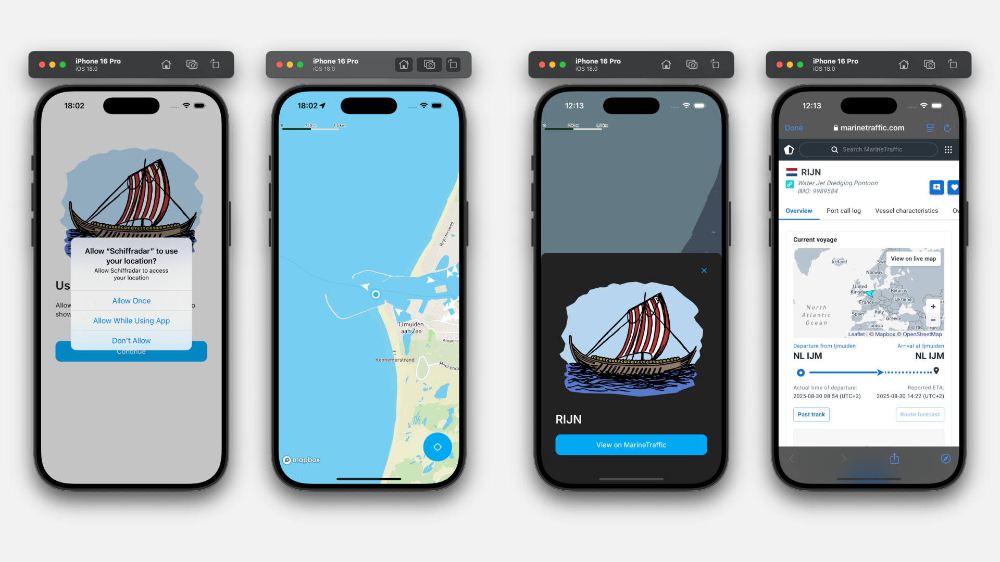

# Schiffradar

[](https://github.com/artyorsh/schiffradar/actions?query=branch%3Amain+event%3Apush)
[](https://github.com/artyorsh/schiffradar/actions?query=branch%3Amain+event%3Aschedule)

## Description

Schiffradar (German for "Ship Radar") - a mobile application that tracks vessels in real-time using AIS data.
Works in combination with [aisstream.io ingestion server](https://github.com/artyorsh/schiffradar-api).



## Stack

- [](https://github.com/expo/expo/blob/main/packages/expo/CHANGELOG.md)
- [](https://github.com/facebook/react-native/releases)
- [](https://github.com/react-navigation/react-navigation/releases)
- [](https://github.com/vitalets/react-native-unistyles/releases)
- [](https://github.com/mobxjs/mobx/releases)
- [](https://github.com/inversify/InversifyJS/releases)
- [](https://github.com/jestjs/jest/releases)
- [](https://github.com/callstack/react-native-testing-library/releases)
- [](https://github.com/rnmapbox/maps/releases)
- [](https://github.com/microsoft/TypeScript/releases)
- [](https://github.com/eslint/eslint/releases)

## Features

- AIS data polling with advanced configuration options (see [architecture components](#key-architecture-components)).
- Interactive map with markers and data clustering.
- Location permissions.
- Vessel details via [MarineTraffic.com](https://www.marinetraffic.com/).
- Splash Screen Animation, fully compatible with expo-splash-screen.
- Light and Dark themes with flexible customization.
- CI/CD with GitHub Actions and EAS.
- Localization and multi-language support via [lingui](https://lingui.dev).
- Modularized architecture with Dependency Injection.

## Setup

Install [Bun](https://github.com/oven-sh/homebrew-bun#install).

```bash
bun i
```

```bash
cp .env.example .env
# Update the:
# - EXPO_PUBLIC_HTTP_BASE_URL
# - EXPO_PUBLIC_MAPBOX_ACCESS_TOKEN,
# - EXPO_PUBLIC_MAPBOX_RNMapboxMapsDownloadToken
```

## Running

Start Metro bundler and follow the instructions in terminal to run the app.

```bash
bun run start
```

## Location

Zuidpier IJmuiden: 52.4637027,4.5297216 (or anything within the ingestor bbox).

### Android

- Configure: Emulator > More > Location > Search
- Reset permissions:`adb shell pm reset-permissions`

### iOS

- Configure: Simulator > Features > Location > Custom Location
- Reset permissions: Reinstall the app or `xcrun simctl erase all`

## Other apps

[LiquidChat](https://github.com/artyorsh/liquid-chat)

## Author

[Artur Yersh](https://artyorsh.me)
